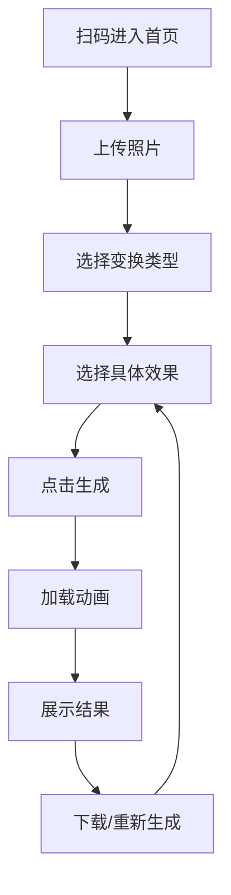

## 1. 产品概述
"世界上的另一个你"是一款面向线下吉他路演现场的生成式AI图片处理Web App。用户通过扫码进入，上传照片即可体验AI变身乐趣，无需下载安装和注册登录，即开即用。

该产品旨在为现场观众提供即时娱乐体验，通过AI风格变换让用户体验不同风格的自己，增加路演活动的互动性和趣味性。

## 2. 核心功能

### 2.1 用户角色
| 角色 | 访问方式 | 核心权限 |
|------|----------|----------|
| Guest（游客） | 扫码进入，无需注册 | 上传照片、选择风格、生成AI图片、下载结果 |

### 2.2 功能模块
本产品包含以下核心页面：
1. **首页**：照片上传区域、风格选择器、生成按钮
2. **生成结果页**：AI变换结果展示、重新生成按钮、下载功能

### 2.3 页面详情
| 页面名称 | 模块名称 | 功能描述 |
|-----------|-------------|-------------|
| 首页 | 照片上传模块 | 点击上传本地人像照片，支持预览和重新选择 |
| 首页 | 风格选择模块 | 展示风格变换和打卡模式两个大类，每个大类下包含具体效果选项 |
| 首页 | 生成按钮 | 点击后开始AI变换，显示加载动画 |
| 生成结果页 | 结果展示模块 | 展示AI变换后的图片，支持全屏查看 |
| 生成结果页 | 操作模块 | 提供重新生成、下载图片、返回首页等功能 |

## 3. 核心流程
用户操作流程如下：
1. 用户扫码进入Web App
2. 上传本地人像照片
3. 选择变换类型（风格变换/打卡模式）
4. 选择具体效果（吉卜力风/黏土风/艾菲尔铁塔/外滩等）
5. 点击生成按钮，观看加载动画（2-3秒）
6. 查看生成结果
7. 可选择下载图片或重新生成

## 4. 用户界面设计

### 4.1 设计风格
- **配色方案**：多巴胺配色，高饱和度、高能量感
  - 主色：亮紫色 (#8B5CF6)
  - 辅色：酸性绿 (#10B981) 和活力橙 (#F59E0B)
  - 背景：渐变色系，营造活力氛围
- **按钮样式**：大圆角设计，圆角半径12-16px
- **字体**：使用系统默认字体，标题18-24px，正文14-16px
- **布局**：卡片式布局，适合单手操作
- **图标**：使用Lucide React图标库，线条简洁

### 4.2 页面设计概述
| 页面名称 | 模块名称 | UI元素 |
|-----------|-------------|-------------|
| 首页 | 照片上传区 | 大尺寸虚线框上传区域，中央显示上传图标，支持拖拽上传 |
| 首页 | 风格选择器 | 网格布局的圆形选项按钮，选中时有缩放动画效果 |
| 首页 | 生成按钮 | 渐变色背景的大按钮，底部固定位置，方便单手点击 |
| 生成结果页 | 结果展示 | 全屏图片展示，支持手势缩放，顶部有返回按钮 |

### 4.3 响应式设计
- 采用移动端优先设计策略
- 适配各种手机屏幕尺寸（320px-428px宽度）
- 所有交互元素都适合拇指操作区域
- 支持触摸滑动和缩放操作

### 4.4 预设风格列表

**风格变换模式：**
1. 吉卜力风 - Studio Ghibli风格，温暖的手绘动画质感
2. 黏土风 - 3D黏土动画风格，可爱圆润
3. 日系动漫 - 日系动漫风格，鲜明的色彩对比

**打卡模式：**
1. 艾菲尔铁塔 - 仿佛在巴黎艾菲尔铁塔前拍照
2. 外滩 - 上海外滩夜景背景
3. 东京塔 - 日本东京塔樱花季背景