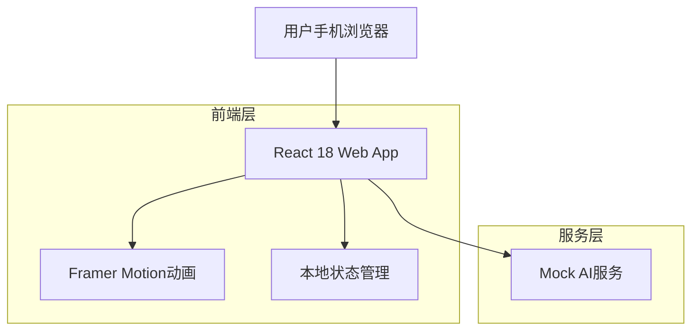

## 1. 架构设计



## 2. 技术描述

- **前端框架**: React 18 + TypeScript + Vite
- **样式方案**: Tailwind CSS + 自定义多巴胺配色
- **动画库**: Framer Motion
- **图标库**: Lucide React
- **图片处理**: 原生File API + Canvas
- **初始化工具**: vite-init
- **后端**: 无（纯前端应用）

## 3. 路由定义

| 路由 | 用途 |
|-------|---------|
| / | 首页，包含照片上传和风格选择 |
| /result | 结果展示页面 |

## 4. 核心数据结构

### 4.1 TransformOption 接口
```typescript
interface TransformOption {
  id: string;
  label: string;
  icon: string;
  category: 'style' | 'location';
  promptTemplate: string;
  previewImage?: string;
}
```

### 4.2 GenerationTask 接口
```typescript
interface GenerationTask {
  id: string;
  originalImage: File;
  selectedOption: TransformOption;
  status: 'pending' | 'processing' | 'completed' | 'failed';
  resultImage?: string;
  createdAt: Date;
}
```

### 4.3 Mock服务设计

**mockAIService.ts**
```typescript
class MockAIService {
  private mockImages = [
    'https://images.unsplash.com/photo-1578662996442-48f60103fc96',
    'https://images.unsplash.com/photo-1558618666-fcd25c85cd64',
    'https://images.unsplash.com/photo-1581009146145-b5ef050c2e1e'
  ];

  async generateImage(
    originalImage: File, 
    option: TransformOption
  ): Promise<string> {
    // 模拟处理延迟
    await this.simulateDelay(2000, 3000);
    
    // 随机选择一张mock图片
    const randomImage = this.mockImages[
      Math.floor(Math.random() * this.mockImages.length)
    ];
    
    return randomImage;
  }

  private simulateDelay(min: number, max: number): Promise<void> {
    const delay = Math.random() * (max - min) + min;
    return new Promise(resolve => setTimeout(resolve, delay));
  }
}
```

## 5. 目录结构

```
src/
├── components/           # React组件
│   ├── ImageUploader/   # 图片上传组件
│   ├── StyleSelector/   # 风格选择器
│   ├── ResultCard/      # 结果展示卡片
│   ├── LoadingView/     # 加载动画
│   └── common/          # 通用组件
├── services/            # 服务层
│   ├── mockAI.ts       # Mock AI服务
│   └── imageProcessor.ts # 图片处理工具
├── hooks/               # 自定义Hooks
│   ├── useImageUpload.ts # 图片上传逻辑
│   └── useGeneration.ts   # 生成逻辑
├── config/              # 配置
│   ├── options.ts        # 风格选项配置
│   └── theme.ts          # 主题配置
├── types/               # TypeScript类型定义
│   ├── transform.ts      # 变换相关类型
│   └── index.ts          # 导出类型
├── utils/               # 工具函数
│   ├── constants.ts      # 常量
│   └── helpers.ts        # 辅助函数
└── App.tsx              # 主应用组件
```

## 6. 状态管理策略

- 使用React useState和useContext进行本地状态管理
- 所有状态在页面刷新时重置
- 主要状态包括：
  - 上传的图片文件
  - 选中的变换选项
  - 生成任务状态
  - 结果图片URL

## 7. 性能优化

- 图片压缩：上传前进行客户端压缩
- 懒加载：结果图片使用懒加载
- 缓存策略：利用浏览器缓存mock图片
- 动画优化：使用Framer Motion的GPU加速动画